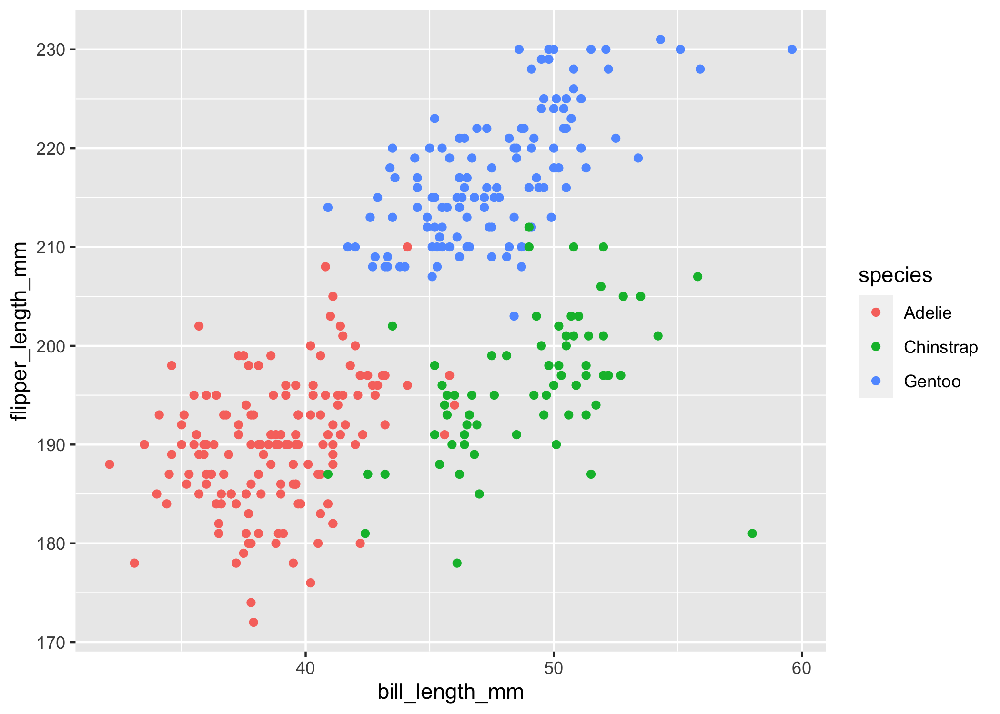

p8105\_hw1\_mjn2142
================
Matthew Neky
9/21/2021

\#\#\#Problem 1

``` r
library(tidyverse)
```

    ## ── Attaching packages ─────────────────────────────────────── tidyverse 1.3.1 ──

    ## ✓ ggplot2 3.3.5     ✓ purrr   0.3.4
    ## ✓ tibble  3.1.4     ✓ dplyr   1.0.7
    ## ✓ tidyr   1.1.3     ✓ stringr 1.4.0
    ## ✓ readr   2.0.1     ✓ forcats 0.5.1

    ## ── Conflicts ────────────────────────────────────────── tidyverse_conflicts() ──
    ## x dplyr::filter() masks stats::filter()
    ## x dplyr::lag()    masks stats::lag()

\#\#Data Frame

``` r
p1_df = tibble(
    ran_samp = rnorm(10),
    vec_logical = ran_samp > 0,
    vec_char = c("A", "B", "C", "D", "E", "F", "G", "H", "I", "J"),
    vec_fac = factor(c("yellow", "blue", "red", "yellow", "blue", "red", "yellow", "blue", "red", "yellow"))
)

knitr::kable(p1_df, format = "html")
```

<table>
<thead>
<tr>
<th style="text-align:right;">
ran\_samp
</th>
<th style="text-align:left;">
vec\_logical
</th>
<th style="text-align:left;">
vec\_char
</th>
<th style="text-align:left;">
vec\_fac
</th>
</tr>
</thead>
<tbody>
<tr>
<td style="text-align:right;">
-2.4521598
</td>
<td style="text-align:left;">
FALSE
</td>
<td style="text-align:left;">
A
</td>
<td style="text-align:left;">
yellow
</td>
</tr>
<tr>
<td style="text-align:right;">
0.0727608
</td>
<td style="text-align:left;">
TRUE
</td>
<td style="text-align:left;">
B
</td>
<td style="text-align:left;">
blue
</td>
</tr>
<tr>
<td style="text-align:right;">
-0.0420794
</td>
<td style="text-align:left;">
FALSE
</td>
<td style="text-align:left;">
C
</td>
<td style="text-align:left;">
red
</td>
</tr>
<tr>
<td style="text-align:right;">
-0.4782448
</td>
<td style="text-align:left;">
FALSE
</td>
<td style="text-align:left;">
D
</td>
<td style="text-align:left;">
yellow
</td>
</tr>
<tr>
<td style="text-align:right;">
1.1231644
</td>
<td style="text-align:left;">
TRUE
</td>
<td style="text-align:left;">
E
</td>
<td style="text-align:left;">
blue
</td>
</tr>
<tr>
<td style="text-align:right;">
-0.4994551
</td>
<td style="text-align:left;">
FALSE
</td>
<td style="text-align:left;">
F
</td>
<td style="text-align:left;">
red
</td>
</tr>
<tr>
<td style="text-align:right;">
0.8314358
</td>
<td style="text-align:left;">
TRUE
</td>
<td style="text-align:left;">
G
</td>
<td style="text-align:left;">
yellow
</td>
</tr>
<tr>
<td style="text-align:right;">
-1.2331073
</td>
<td style="text-align:left;">
FALSE
</td>
<td style="text-align:left;">
H
</td>
<td style="text-align:left;">
blue
</td>
</tr>
<tr>
<td style="text-align:right;">
-0.0203568
</td>
<td style="text-align:left;">
FALSE
</td>
<td style="text-align:left;">
I
</td>
<td style="text-align:left;">
red
</td>
</tr>
<tr>
<td style="text-align:right;">
-0.7204004
</td>
<td style="text-align:left;">
FALSE
</td>
<td style="text-align:left;">
J
</td>
<td style="text-align:left;">
yellow
</td>
</tr>
</tbody>
</table>

``` r
##Means of Data Frame Variables

mean(p1_df %>% pull(ran_samp))
```

    ## [1] -0.3418443

``` r
mean(p1_df %>% pull(vec_logical))
```

    ## [1] 0.3

``` r
mean(p1_df %>% pull(vec_char))
```

    ## Warning in mean.default(p1_df %>% pull(vec_char)): argument is not numeric or
    ## logical: returning NA

    ## [1] NA

``` r
mean(p1_df %>% pull(vec_fac))
```

    ## Warning in mean.default(p1_df %>% pull(vec_fac)): argument is not numeric or
    ## logical: returning NA

    ## [1] NA

\#Mean can only be taken for ran\_samp and vec\_logical because they
have numeric values associated with them, not vec\_char or vec\_fac
which only have characters associated with them.

\#\#\#Problem 2

\#\#Basic Penguins Data Info

``` r
data("penguins", package = "palmerpenguins")

print(penguins)
```

    ## # A tibble: 344 × 8
    ##    species island    bill_length_mm bill_depth_mm flipper_length_mm body_mass_g
    ##    <fct>   <fct>              <dbl>         <dbl>             <int>       <int>
    ##  1 Adelie  Torgersen           39.1          18.7               181        3750
    ##  2 Adelie  Torgersen           39.5          17.4               186        3800
    ##  3 Adelie  Torgersen           40.3          18                 195        3250
    ##  4 Adelie  Torgersen           NA            NA                  NA          NA
    ##  5 Adelie  Torgersen           36.7          19.3               193        3450
    ##  6 Adelie  Torgersen           39.3          20.6               190        3650
    ##  7 Adelie  Torgersen           38.9          17.8               181        3625
    ##  8 Adelie  Torgersen           39.2          19.6               195        4675
    ##  9 Adelie  Torgersen           34.1          18.1               193        3475
    ## 10 Adelie  Torgersen           42            20.2               190        4250
    ## # … with 334 more rows, and 2 more variables: sex <fct>, year <int>

``` r
nrow(penguins)
```

    ## [1] 344

``` r
ncol(penguins)
```

    ## [1] 8

``` r
mean(penguins$flipper_length_mm, na.rm = TRUE)
```

    ## [1] 200.9152

\#\#Scatterplot of Flipper Length vs. Bill Length

``` r
peng_plot = ggplot(penguins, aes(x = bill_length_mm, y = flipper_length_mm, color = species)) + geom_point()
ggsave("peng_plot.png")

```


